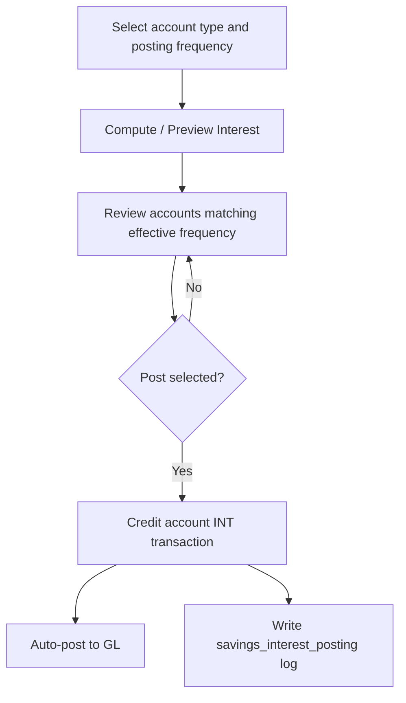

# Automated Savings Interest Posting (Monthly / Quarterly)

## Overview

The savings module supports **batch interest computation and posting** for cooperative savings deposits. Interest is configured **per savings account type** (product) as the default, with an optional **per-member-account frequency override**. Interest is computed from transaction history over a completed month or quarter, previewed before posting, and recorded through the same transaction and General Ledger pipeline used for manual interest.

This replaces the previous workflow where interest had to be entered one account at a time on the Deposit/Withdrawal screen, even though `interest_rate` was already stored on each account type.

**Related documentation:** [Savings Account GL Posting](SAVINGS_ACCOUNT_GL_POSTING.md) — how interest (and other savings) transactions post to the General Ledger.

---

## Features

- **Per-product interest setup** — rate, frequency (None / Monthly / Quarterly), computation basis, and minimum balance to earn interest
- **Per-account frequency override** — optional Monthly / Quarterly / None on a member savings account; otherwise inherits the product default
- **Three computation bases** — Average Daily Balance (ADB), Lowest Balance, End-of-Period Balance (EOP)
- **Preview before posting** — review every account, effective frequency, base balance, days, and computed interest before confirming
- **Duplicate protection** — posting log prevents the same account from being credited twice for the same period
- **Audit trail** — Interest Posting History lists all batch postings with receipt links
- **GL integration** — posted interest uses existing `INT` credit logic and auto-posts debit interest expense / credit savings liability
- **Void support** — voiding an interest receipt marks the posting log as VOIDED so the period can be re-run for that account
- **Role-based access** — `Interest_posting` permission under the Savings module (Module 3)

---

## Installation

### Step 1: Run the install scripts

Open in a browser (or run via PHP CLI):

```
http://your-domain.com/install_savings_interest_posting.php
http://your-domain.com/install_savings_interest_account_override.php
```

Both scripts are **idempotent** — safe to run more than once.

`install_savings_interest_posting.php` will:

1. Add columns to `saving_account_type`:
   - `interest_frequency` — `NONE` (default), `MONTHLY`, or `QUARTERLY`
   - `interest_basis` — `ADB` (default), `LOWEST`, or `EOP`
   - `interest_min_balance` — minimum base balance required to earn interest (default `0`)
2. Create table `savings_interest_posting` (posting log / duplicate guard)
3. Register role `Interest_posting` under Savings (Module 3) and grant it to all existing user groups

`install_savings_interest_account_override.php` will:

1. Add `members_account.interest_frequency` — `NULL` = inherit product default; `NONE` / `MONTHLY` / `QUARTERLY` = override for that account only

### Step 2: Prerequisites

Before posting interest, ensure:

1. **Savings GL posting** is configured — run `install_savings_gl_posting.php` if needed. See [SAVINGS_ACCOUNT_GL_POSTING.md](SAVINGS_ACCOUNT_GL_POSTING.md).
2. Each savings account type has:
   - **Account Setup** — GL liability account
   - **Account Setup for Interest Rate** — stored for reference (GL interest expense is resolved by account name lookup)
3. An **interest expense account** exists in the chart of accounts (name/description contains “Interest”, account type 50 or 70000).

### Step 3: Configure account types

Go to **Settings → Saving Account Type List → Edit** each product and complete the **Interest Setup** section (see [Configuration](#configuration) below).

---

## Configuration

### Product defaults (account type)

Path: **Settings → Saving Account Type List → Edit**

| Field | Description |
|-------|-------------|
| **Interest Rate** | Annual percentage rate (% p.a.). Must be greater than 0 for batch posting to include this type. |
| **Interest Frequency** | Product default: `None` / `Monthly` / `Quarterly`. Used when the member account has no override. |
| **Computation Basis** | See [Computation bases](#computation-bases). Default and recommended: **Average Daily Balance**. |
| **Minimum Balance to Earn Interest** | Accounts whose computed base balance is below this amount earn **no** interest for the period. |

Rate, basis, and minimum balance always come from the **product**. Only frequency can be overridden per account.

### Per-account frequency override

Path: **Savings → Create Saving Account** or **Edit Saving Account**

| Value | Meaning |
|-------|---------|
| **Use product default** | Inherit frequency from the savings account type (recommended for most members) |
| **None** | This account never gets batch interest |
| **Monthly** | Include this account when running a Monthly posting |
| **Quarterly** | Include this account when running a Quarterly posting |

**Effective frequency** = account override if set, otherwise product default.

Example: “Savings Deposit - Special” default = Monthly. Most Special accounts stay monthly. Set one member to Quarterly on Edit Account — that account only appears when you run Quarterly posting for Special.

---

## How to use — Interest Posting

Path: **Savings → Interest Posting**  
URL: `/en/saving/interest_posting` (language prefix may vary)

### Workflow



### Step-by-step

1. **Select savings account type** — types with rate &gt; 0 and either a product frequency ≠ None or at least one account override.
2. **Select posting frequency** — Monthly or Quarterly (independent of product default; used to choose the period UI and which accounts to include).
3. **Select period**
   - **Monthly:** pick a completed calendar month.
   - **Quarterly:** pick quarter (Q1–Q4) and year.
4. Click **Compute / Preview Interest**.
5. Review the preview table — only accounts whose **effective frequency** matches the posting frequency appear. Overrides are labeled.
6. Check the accounts to post and click **Post Selected Interest**.

Accounts with effective frequency **None**, or the other frequency, are simply omitted from that run (not double-posted).

### Transaction details

Each posted account creates:

- A **credit** on `members_account.balance` via `add_saving_transaction('INT', ...)`
- A row in `savings_transaction` with `system_comment = 'INTEREST'`
- Payment method: `SYSTEM`
- Transaction date: **last day of the period** (`period_end`)
- Comment example: `INTEREST FOR MAY 2025 (ADB 21,265.69 @ 6% p.a.)`

Receipts can be viewed from the posting history or **Savings → Search Transaction** (filter by INTEREST).

---

## Interest computation

### Formula

```
Interest = base_balance × (annual_rate ÷ 100) × days_in_period ÷ 365
```

- Result is rounded to **2 decimal places**.
- Accounts with zero or negative computed interest are skipped.
- **Days in period** = inclusive calendar days from `period_start` to `period_end` (e.g. May = 31 days).

### Balance used

Interest is computed on the **total deposit**:

```
total_balance = members_account.balance + members_account.virtual_balance
```

The maintaining balance (`virtual_balance`) is included because it remains the member’s deposit; the separate **Minimum Balance to Earn Interest** setting controls eligibility.

### Computation bases

| Code | Name | Description |
|------|------|-------------|
| **ADB** | Average Daily Balance | Mean of end-of-day balances for every day in the period. **Recommended** — modern cooperative standard. |
| **LOWEST** | Lowest Balance | Minimum end-of-day balance during the period. |
| **EOP** | End-of-Period Balance | Balance at the close of the last day of the period. |

### How daily balances are derived

The engine does **not** store a daily balance table. It reconstructs balances from the transaction ledger:

1. Anchor at current `balance + virtual_balance`.
2. Walk `savings_transaction` **backward** from today to derive balance at period end.
3. Apply daily net movement (CR adds, DR subtracts) across the period.
4. **Void reversal rows** (`system_comment` starting with `VOID TRANSACTION`) are **excluded** — they exist in the ledger but do not update `members_account.balance` in the current void implementation.

This approach was validated against live accounts: replayed ledger totals match stored balances when void rows are excluded.

### Eligibility rules

An account is **eligible** for posting when all of the following are true:

- Account status is active (`status = 1` or NULL)
- Computed base balance ≥ `interest_min_balance`
- Computed interest > 0
- No existing **POSTED** row in `savings_interest_posting` for the same account and period

---

## Interest Posting History

Path: **Savings → Interest Posting → Interest Posting History** (link on the posting page)  
URL: `/en/saving/interest_posting_history`

Lists all batch interest postings with:

- Posted date/time, account, member, account type, period, basis, rate, base balance, days, amount, receipt (link), status (Posted / Voided)

Filter by account type using the dropdown at the top.

---

## Voiding interest

If an interest transaction is voided from **Savings → Search Transaction**:

1. The existing void flow creates a reversing ledger entry and GL adjustment.
2. The matching `savings_interest_posting` row (by receipt) is set to **VOIDED**.
3. That account becomes eligible again for the same period on the next preview/post run.

---

## Permissions

| Role name | Module | Menu item |
|-----------|--------|-----------|
| `Interest_posting` | 3 (Savings) | Interest Posting |

Manage via **User Manager → Assign Privilege**. The install script grants this role to all existing groups; restrict per group as needed.

Other savings permissions are unchanged (`Deposit_Withdrawal`, `Savings_transactions`, etc.).

---

## Database schema

### New columns on `saving_account_type`

| Column | Type | Default | Description |
|--------|------|---------|-------------|
| `interest_frequency` | VARCHAR(10) | `NONE` | Product default: `NONE`, `MONTHLY`, `QUARTERLY` |
| `interest_basis` | VARCHAR(10) | `ADB` | `ADB`, `LOWEST`, `EOP` |
| `interest_min_balance` | DECIMAL(15,2) | `0` | Minimum base balance to earn interest |

Existing column `interest_rate` is the annual rate (%).

### New column on `members_account`

| Column | Type | Default | Description |
|--------|------|---------|-------------|
| `interest_frequency` | VARCHAR(10) | `NULL` | `NULL` = inherit product default; `NONE` / `MONTHLY` / `QUARTERLY` = override |

### New table: `savings_interest_posting`

| Column | Description |
|--------|-------------|
| `id` | Primary key |
| `PIN` | Cooperative tenant ID |
| `account` | Savings account number |
| `account_cat` | Savings account type code |
| `period_type` | `MONTHLY` or `QUARTERLY` |
| `period_start` | First day of period (DATE) |
| `period_end` | Last day of period (DATE) |
| `basis` | Basis used (`ADB`, `LOWEST`, `EOP`) |
| `annual_rate` | Rate applied |
| `base_balance` | Computed base balance |
| `days` | Days in period |
| `interest_amount` | Amount posted |
| `receipt` | `savings_transaction.receipt` |
| `status` | `POSTED` or `VOIDED` |
| `createdby` | User ID |
| `createdon` | Timestamp |

**Unique key:** `(PIN, account, period_start, period_end)` — prevents duplicate postings for the same period.

---

## General Ledger entries

Posted batch interest uses the same GL logic as manual interest. See [SAVINGS_ACCOUNT_GL_POSTING.md](SAVINGS_ACCOUNT_GL_POSTING.md).

| Entry | Account | Amount |
|-------|---------|--------|
| Debit | Interest expense (auto-resolved) | Interest amount |
| Credit | Savings liability (`account_setup` on account type) | Interest amount |

Journal: Savings Journal (ID 9), or Manual Journal (ID 5) as fallback.

---

## Files reference

### Installation

| File | Purpose |
|------|---------|
| `install_savings_interest_posting.php` | Product interest columns, posting log, permission |
| `install_savings_interest_account_override.php` | Per-account frequency override column |

### Controllers

| File | Methods |
|------|---------|
| `application/controllers/saving.php` | `interest_posting()`, `interest_posting_history()`, create/edit account interest override |
| `application/controllers/setting.php` | `saving_account_typecreate()` — product interest setup |

### Model

| File | Key methods |
|------|-------------|
| `application/models/finance_model.php` | `effective_interest_frequency()`, `normalize_interest_frequency_override()`, `interest_enabled_account_types()`, `compute_interest_for_period(..., $run_frequency)`, posting log helpers |

### Views

| File | Purpose |
|------|---------|
| `application/views/saving/interest_posting.php` | Account type + posting frequency + preview/post |
| `application/views/saving/interest_posting_history.php` | Posting audit log |
| `application/views/saving/create_account.php` | Optional interest frequency override |
| `application/views/saving/edit_account.php` | Optional interest frequency override |
| `application/views/setting/saving_account_typecreate.php` | Product Interest Setup |
| `application/views/setting/saving_account_typelist.php` | Interest columns in list |
| `application/views/newmenu.php` | Savings menu — Interest Posting link |

### Language

| File | Keys prefixed with `interest_` |
|------|--------------------------------|
| `application/language/english/systemlang_lang.php` | English labels |
| `application/language/swahili/systemlang_lang.php` | Swahili labels (same keys) |

---

## Troubleshooting

### “No savings account types are configured for automatic interest”

- Edit each account type under **Settings → Saving Account Type**.
- Set **Interest Frequency** to Monthly or Quarterly.
- Ensure **Interest Rate** is greater than 0.

### “Invalid period. Only fully completed months/quarters can be posted.”

- You cannot post interest for the current month/quarter until its last calendar day has passed.
- Example: on June 13, 2026, the latest monthly period is May 2026.

### Account shows “Already Posted”

- That account already has a POSTED row in `savings_interest_posting` for the selected period.
- To re-post: void the original interest receipt from Search Transaction (sets log to VOIDED), then run preview/post again.

### Account shows “Below Minimum Balance”

- Computed base balance is below **Minimum Balance to Earn Interest** on the account type.
- Lower the threshold in settings or verify balances/transactions for the period.

### GL posting failed but interest credited

- Transaction succeeds even if GL fails (same as manual interest).
- Check `application/logs/` for messages containing `Savings account GL posting failed`.
- Ensure an interest expense account exists in the chart of accounts.
- Ensure `account_setup` (liability) is configured on the account type.

### Interest amount seems wrong

1. Confirm **Computation Basis** (ADB vs Lowest vs EOP).
2. Check deposits/withdrawals during the period — ADB weights every day.
3. Verify total balance includes maintaining balance (`balance + virtual_balance`).
4. Confirm annual rate and day count: `days_in_period` is inclusive.

### Menu item “Interest Posting” not visible

- User’s group needs `Interest_posting` permission (Module 3).
- Re-run install script or assign via **Assign Privilege**.

---

## Design notes

- **Manual posting only** — there is no cron/scheduler; an administrator runs the batch page each period (same pattern as automatic CBU contribution processing).
- **No withholding tax** — not implemented; can be added later as a per-type setting if required.
- **Idempotent posting** — re-running preview for a posted period is safe; already-posted accounts are flagged and excluded from selection.
- **Coexists with manual INT** — staff can still post interest manually via Deposit/Withdrawal; batch posting adds computation, preview, duplicate guard, and audit log.

---

## Quick reference — URLs

| Page | URL pattern |
|------|-------------|
| Interest Posting | `/{lang}/saving/interest_posting` |
| Interest Posting History | `/{lang}/saving/interest_posting_history` |
| Saving Account Types (settings) | `/{lang}/setting/saving_account_typelist` |
| Install scripts | `/install_savings_interest_posting.php`, `/install_savings_interest_account_override.php` |

Replace `{lang}` with `en` or `sw` as configured.
